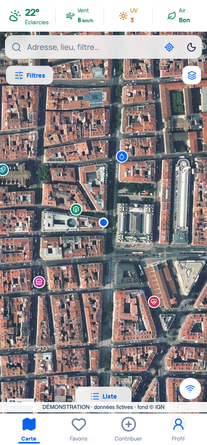
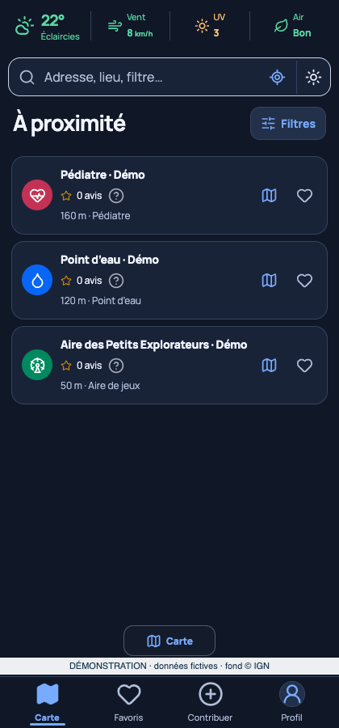
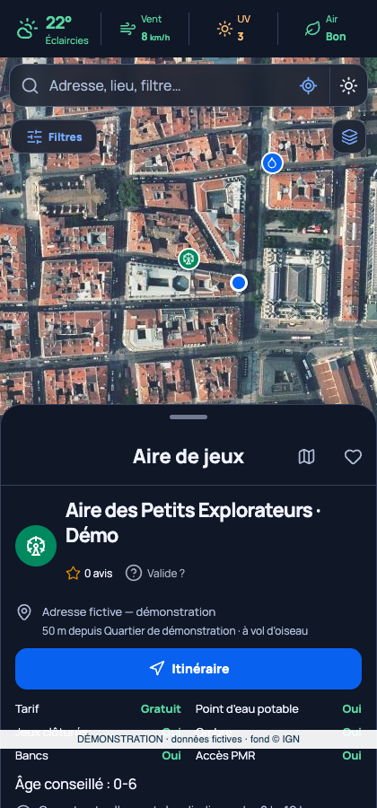

<p align="center"></p>

# Cailloute — les bons coins pour sortir avec ses enfants

Quand on devient parent, même une petite sortie peut demander un peu d’organisation. Où changer bébé ? Où trouver de l’eau, acheter ce qui manque ou laisser les plus grands jouer ? **Cailloute est pensée pour les parents qui cherchent des lieux adaptés à leur bébé ou à leurs enfants, en France métropolitaine et en Corse.**

Application Android et interface web entièrement en français, avec carte, liste et thèmes jour/nuit. Le code est ouvert et la première bêta publique attend vos retours.

[**Télécharger la bêta Android**](https://github.com/AntoineViallefont/Cailloute/releases/tag/v0.1.63-beta.1) · [**Devenir testeur**](https://github.com/AntoineViallefont/Cailloute/issues/new?template=testeur.yml) · [Signaler un problème](https://github.com/AntoineViallefont/Cailloute/issues/new?template=probleme.yml)

## Ce que vous pouvez faire

- Explorer les aires de jeux, activités et lieux utiles : points d’eau, toilettes, tables à langer, magasins, transports, pharmacies, pédiatres et urgences référencées.
- Consulter une carte ou une liste, rechercher une ville ou une adresse et affiner les résultats avec les filtres disponibles : âge, accessibilité, gratuité, équipements et catégories.
- Ouvrir les fiches, consulter leurs sources, leurs horaires lorsqu’ils sont renseignés et les retrouver dans vos favoris.
- Choisir une zone sur la carte, lancer un itinéraire dans une application externe et consulter la météo indicative.
- Ajouter ou corriger des lieux, laisser un avis et préparer des photos avec masquage local des visages et vérification manuelle.
- Conserver des informations localement et enregistrer des zones de carte pour un usage hors connexion. Les zones non enregistrées, les nouveaux tracés, la recherche d’adresse et la météo peuvent nécessiter Internet.

**La consultation est possible sans compte. Pour participer aux contributions partagées, il est recommandé de créer un compte ou de se connecter avec Google.** La publication nécessite un compte vérifié, l’acceptation des conditions et le respect des quotas. L’ancien historique personnel reste privé. Les favoris du compte peuvent être synchronisés entre appareils.

## Aperçu

Captures réelles de l’application exécutée dans un environnement de test isolé. Les lieux, avis et données météo illustrés sont fictifs et portent la mention « Démonstration ». Le fond de carte est celui de l’IGN ; aucune donnée de compte réel n’est affichée.

| Vue satellite de jour | Liste de nuit | Fiche d’un lieu fictif |
| --- | --- | --- |
|  |  |  |

## Installer ou mettre à jour

1. Ouvrez la [page de la bêta](https://github.com/AntoineViallefont/Cailloute/releases/tag/v0.1.63-beta.1) et téléchargez `Cailloute-0.1.63-beta.apk` sur votre téléphone.
2. Android **9 ou plus récent** est nécessaire, sur appareil ARM 32 ou 64 bits. Autorisez l’installation depuis le navigateur ou le gestionnaire de fichiers uniquement si Android le demande pour ce fichier.
3. Ouvrez l’APK et choisissez **Installer** ou **Mettre à jour**. Pour conserver vos données, **ne désinstallez pas** l’application existante et n’effacez pas son stockage.

La bêta utilise une clé dédiée à Cailloute avec une preuve de rotation depuis l’ancienne signature. Les contrôles de migration et leurs limites figurent dans [le rapport de validation](docs/VALIDATION.md). Les futures mises à jour seront proposées sur GitHub ; il n’y a pas de mise à jour automatique intégrée.

Les fichiers `SHA256SUMS.txt`, `MANIFESTE.json`, les sources correspondantes et les données ouvertes accompagnent la version. [Vérifier les fichiers et compiler](docs/COMPILER.md).

## Participer

- [Signaler un problème](https://github.com/AntoineViallefont/Cailloute/issues/new?template=probleme.yml)
- [Proposer une amélioration](https://github.com/AntoineViallefont/Cailloute/issues/new?template=amelioration.yml)
- [Se porter volontaire comme testeur](https://github.com/AntoineViallefont/Cailloute/issues/new?template=testeur.yml)

Ces formulaires sont **publics**. N’y indiquez aucune adresse e-mail ou Google, aucun mot de passe, domicile, photo d’enfant ni localisation personnelle. Un pseudonyme GitHub suffit. Les signalements sensibles disposent du [canal de sécurité privé](SECURITY.md).

La bêta GitHub ne requiert pas d’inscription Google Play ni de nombre minimal de testeurs. Une diffusion Google Play sera envisagée seulement si l’intérêt se confirme ; aucun calendrier n’est promis. [Comment tester et distinction avec Google Play](docs/TESTEURS.md).

## À savoir avant de tester

C’est une bêta : des erreurs, lenteurs ou interruptions sont possibles. La couverture varie selon les sources ; les équipements, horaires, tarifs et conditions d’accès peuvent être incomplets ou périmés. Vérifiez les informations auprès du lieu, en particulier pour la santé. Cailloute n’est ni un service d’urgence ni une garantie d’accessibilité ou de sécurité.

La consultation ne nécessite pas de paiement dans cette bêta. Les services externes ont leurs conditions et limites ; le partage Firebase peut se mettre en pause lorsque ses quotas sont atteints. Aucune disponibilité permanente ou gratuité illimitée n’est promise. Les lieux référencés peuvent être payants.

[Confidentialité](docs/CONFIDENTIALITE.md) · [Limites connues](docs/LIMITES.md) · [Licences et crédits](docs/LICENCES.md) · [Contribuer au code](CONTRIBUTING.md)

## Code source

Le code original est sous **licence MIT**. Les données, polices, modèles et bibliothèques conservent leurs propres licences, notamment ODbL, Licence Ouverte, OFL et LGPL. Le logo est régi séparément. Les textes juridiques tiers sont conservés dans leur langue originale ; l’application et la documentation d’utilisation restent en français.

```sh
git clone https://github.com/AntoineViallefont/Cailloute.git
cd Cailloute
python3 scripts/telecharger-donnees.py
npm --prefix app ci
npm --prefix app run dev
```

Ouvrez `http://127.0.0.1:5187/`. Ce démarrage utilise le mode personnel local ; les services externes de carte et météo restent sollicités à la demande. [Instructions complètes de compilation](docs/COMPILER.md).
